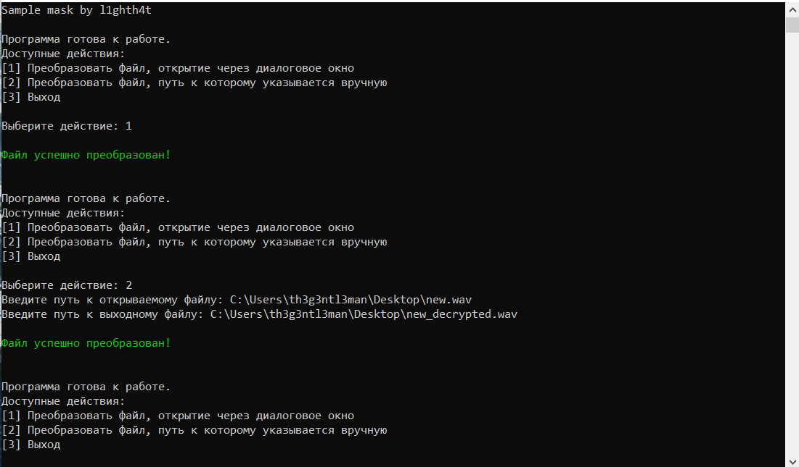

# Sample mask
Приложение на .NET Core для шифрования звука в аудиофайлах.

## Описание
Данная утилита производит шифрование звука в аудиофайлах с помощью инверсии спектра аудиосигнала. Пока программа может работать только с аудиофайлами формата Wave. Глубина кодирования целевого файла 16 бит, моно, частота дискретизации рекомендуется не менее 44100 Гц. Чтобы расшифровать файл, нужно прогнать его через этот алгоритм ещё раз. Таким образом, информация в защищаемом аудиофайле превратится в набор шума, и файл при этом останется читаемым.

## Как программа работает
Приложение считывает данные из аудиофайла, преобразует двоичные данные в аудиосигнал. Над полученным сигналом выполняется дискретное преобразование Фурье, в результате которого получаются коэффициенты разложения. Далее полученные коэффициенты переставляются в обратном порядке. Затем выполняется обратное дискретное преобразование Фурье, после которого спектр аудиосигнала становится инверсным по отношению к исходному. Далее программа оцифровывает получившийся сигнал и записывает его в новый аудиофайл, оставляя при этом заголовок исходного.

## Использование
Интерфейс программы позволяет открыть целевой файл как с помощью диалогового окна, так и прописав путь вручную. Приложение предложит три варианта: преобразовать файл, открыв его через даалоговие окно, преобразовать файл, прописав к нему путь вручную, и завершение работы программы. В первых двух вариантах программа предложит выбрать целевой файл в файловой системе вашего компьютера, и в случае успешного преобразования предложит выбрать путь его сохранения. Пример работы программы представлен ниже:

## Благодарности
Данный проект является программной реализацией способа маскирования аналоговых речевых сигналов, описанного в патенте РФ №2546614.

## License
